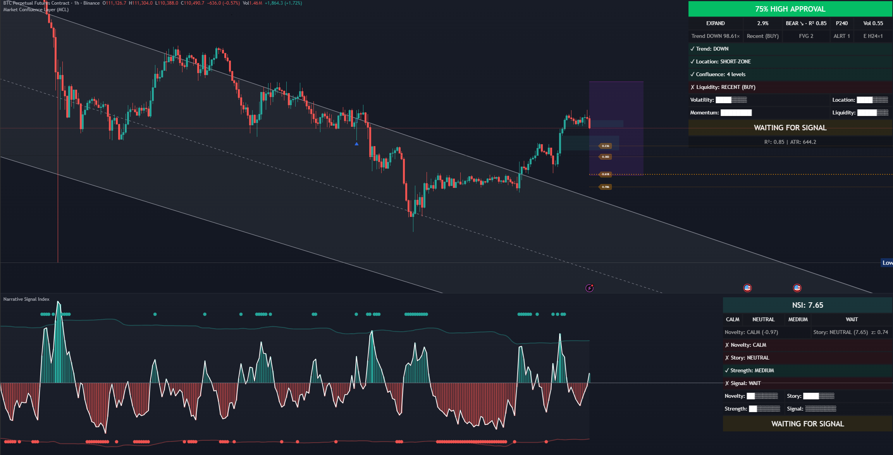

# Trading Indicators Collection

**Note:** This is a learning project and may contain errors. Use at your own risk.

This collection includes two complementary indicators designed to capture both **structural** and **behavioral** aspects of the market — combining market confluence with sentiment-driven signals.

## Market Confluence Layer (MCL)

Multi-timeframe confluence indicator combining fractals, FVG, liquidity sweeps, and market profile analysis.

### Features:
- Fractal-based support/resistance  
- Fair Value Gap detection  
- Liquidity sweep identification  
- Adaptive market profile channels  
- Smart approval checklist  

## Narrative Signal Index (NSI)

Advanced sentiment analysis indicator using Jensen–Shannon Divergence to quantify and detect shifts in market narratives.

### Features:
- 3-bin return distribution analysis  
- Novelty detection via JSD divergence  
- Direction calculation from price action  
- Volatility shock detection  
- Multi-filter signal generation  
- Real-time info panel  
